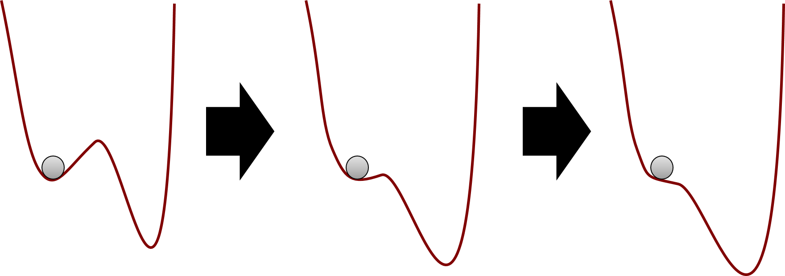

```{r load-data, include = FALSE}

library(knitr)
library(tidyverse)
library(bookdown)

knitr::opts_chunk$set(echo = FALSE, 
               warning = FALSE,
               message = FALSE,
               error = TRUE,
               cache = FALSE, 
               collapse = TRUE,
               dpi = 300
               )


# rmarkdown::render(input = "_complexity-manuscript.Rmd", output_format = "papaja::apa6_word", encoding = "UTF-8")
# citr::tidy_bib_file(rmd_file = "_complexity-manuscript.Rmd", messy_bibliography = "baseline-visu.bib")
```

\newpage

# Introduction

In order to understand why behavioural interventions often fail to produce sustainable effects [@kwasnickaTheoreticalExplanationsMaintenance2016], especially when transferred from one context to another, a core interest of behaviour change science is to improve our understanding of mechanisms of behaviour change. Behavioural theories identify hundreds of potential "determinants" of behaviour, that is, factors that potentially influence the behaviour of interest, constituting the mechanisms by which behaviour change techniques might influence behaviour [@careyBehaviorChangeTechniques2019]. These range from cognitions such as self-efficacy and attitudes, to biological factors, and certain elements of the social and built environments in which behaviours take place [@michieABCBehaviourChange2014]. When studied using typical linear designs and statistical models, the relationships between causal precedents and behaviour change are assumed to be additive, constant and linear (i.e. the outputs are proportional to the inputs). However, it is our position that this offers behaviour change researchers and the general public an inaccurate or at least imprecise understanding of behaviour change. New paradigms are needed, which consider the relevant factors as complex, potentially non-linear, and dynamic. 

The evaluation of behaviour change interventions typically involves randomly assigning participants to receive an intervention of interest or a specific comparator and measuring subjective and objective indicators of behaviour. Usually, these measurements occur immediately before and after the delivery of the intervention, though sometimes additional follow-up measurements may take place weeks or months later. This is the classic Randomised Controlled Trial design and the data produced are most often analysed using statistical techniques that are specific cases of the General Linear Model. We refer to this as the conventional approach in this paper. If the interest is only in assessing whether the treatment overall was more effective, on average, in the intervention group than the control group, comparing averages in randomised controlled trials can be purposeful and acceptable (i.e. answering questions such as "Does the intervention have an effect on the target behaviour?", "Do cohorts differ from each other?"). However, studying behaviour change mechanisms ("How do intervention participants change?") with few measurement points only, results in problems. Limiting the study of behaviour change dynamics in that way, also limits our understanding of how changes occur under different conditions over time. Recently, solutions stemming from complex systems science [@siegenfeldIntroductionComplexSystems2019] have become increasingly accessible and helpful in tackling problems of understanding change processes.

While a reliance on linear models simplifies the analytical approaches needed to explore relationships between variables, it does not contribute to our understanding of how the world works, as "most of everyday life is nonlinear" [@strogatzNonlinearDynamicsChaos2018, p. 9] and outside the physical sciences, nonlinear systems are "the rule, not the exception" [@maySimpleMathematicalModels1976, p. 467]. As an intuitive example, consider that falling from 10 meters is likely to kill you, but falling from one meter does not make you 1/10th dead – in fact, it makes you stronger [@talebAntifragileThingsThat2012; @talebAntifragilityMathematicalIdea2013]. Or that eating twice the size of a normal meal rarely results in twice the pleasure. Human behaviour is complex, and while we have formulated theoretical constructs to be as amenable as possible to linear methods of analysis, this may obscure important characteristics of behaviour change. This paper will 1) outline the complexity of behaviours and behaviour change interventions, 2) introduce readers to some key features of complex systems and how these can be applied to human behaviour, and 3) provide concrete suggestions for how researchers can better account for the implications of complexity in analysing behaviour change mechanisms. 

## What are complex systems?

A system is "a delineated part of the universe which is distinguished from the rest by an imaginary boundary" [@bar-yamConceptsSystem2018], although other definitions exist [see @wrightThinkingSystemsPrimer2009 for a primer]. Many things---a central nervous system, a school, a community, a society---can be conceptualised as systems (or interacting levels of a single system). This paper focuses on individual people as complex systems. Complex systems can be characterised as webs of many interdependent self-organising parts that operate without central control, whose interactions give rise to emergent properties and behaviours [@mitchellComplexityGuidedTour2009]. The future behaviour of such a system strongly depends on its unique history of interactions, that is, past experience. Additionally, individual persons or other system components contribute and adapt to each others’ environments, coevolving with each other to create macro-level behaviour, which is difficult to predict and usually not changeable in a stepwise engineering sense [@brandTailoringHealthyWorkplace2015]. These characteristics distinguish complex systems from those which are just complicated: Highly complicated processes or systems (e.g. an airplane), unlike complex ones (e.g. an organism) cannot, for example, self-organise to function adaptively when a part is removed [@ricklesSimpleGuideChaos2007]. Guides to basic terminology of chaos and complexity for scientists working with health behaviours can be found in Rickles, Hawe and Shiell [-@ricklesSimpleGuideChaos2007] as well as table 1 of Brand et al. [-@brandTailoringHealthyWorkplace2015]. Complex adaptive systems in the behaviour change research context have been previously discussed by @gomersallComplexAdaptiveSystems2018, with a focus on simulation and qualitative methods. We complement this contribution by discussing candidate quantitative modelling solutions to investigate behavior change phenomena with a complex systems lens.

## The relevance of complexity for behaviour change

To paint a picture of just how complex the behavioural world is, take the case of physical activity as an example behaviour. Already three and a half decades ago, more than 30 influences on (or "determinants of") this behaviour were being considered, along with calls for better understanding of their dynamics, interactions, and the time scales over which these develop [@dishmanDeterminantsPhysicalActivity1985]. While any influence (e.g. intention, attitude) could have a direct relationship with physical activity, some rely on interactions with other influences to affect behaviour [e.g. preventive behaviours being dependent on fear only in the presence of sufficient efficacy beliefs; @kokIgnoringTheoryMisinterpreting2018; @petersConsensusFearAppeals2018]. Furthermore, these interactions may be moderated by additional factors, and by other variables which themselves have no direct relationship with physical activity, with synergistic and opposing effects which may themselves depend on whether some threshold is exceeded. The extent to which all known (and unknown) influences on physical activity interact with one another presents a map of practically infinite, intertwined ‘routes’ to initiating and maintaining the activity. 

As mentioned above, evaluations of behaviour change interventions tend to focus on whether change occurs, while neglecting a focus on how behaviour changes. In attempts to understand how physical activity changes, the role of time brings added complexity to this behavioural world, as patterns of activity change over time and at varying frequencies. For example, fluctuations clearly occur within a day, as most individuals are (at least in the absence of highly sedentary working conditions and considerable somnambulism) more active while awake than while asleep. Fluctuation also occurs over the course of a week, as activity levels tend to be higher on weekdays than on weekends [@matthewsSourcesVarianceDaily2002]; over the course of months, as activity levels are higher in warmer seasons and lower in colder ones [@cepedaSeasonalityPhysicalActivity2018]; and over the course of years, as activity levels tend to decline with age [@dumithPhysicalActivityChange2011]. 

Therefore, as said above, the conventional approach of using linear models to assess behaviour change over very few time points limits the types of research questions we can ask about how behavioural changes occur. <!-- Maybe you need to add something about the role of time/dynamics vs statics… that is, complex systems are modelled as dynamic systems of coupled differential equations, which means these are models of processes, autocatalytic, time is flowing, time is not a predictor. --> Why are linear models inappropriate for many of our research questions in the behavioural sciences? First, with many nonlinear interactions across time scales, our simplistic notions of causality (including mediation and moderation) might become deficient at best [@richardsonInteractionDominantDynamicsTimescale2017; @ricklesCausalityComplexInterventions2009]. Second, traditional statistical analyses may lead us astray, as there are enough potential context-dependent patterns to be "analogous to higher order interaction terms that could involve 5, 10, or 15-way interactions" in linear models [@resnicowChaoticViewBehavior2006] -- everything depends on everything else, contributing to what Meehl [-@meehlWhySummariesResearch1990, p. 204] coined as "the crud factor". This also means a violation of the assumptions regarding independence and interference [@finkSocialDeterminantsPopulation2016; @wallotInteractionDominantCausationMind2017]. Finally, forecasting in complex systems is notoriously difficult [@makridakisDecisionMakingPlanning2009; @makridakisForecastingSocialSettings2019], making hypothesis testing---which is, after all, the test of a prediction---in intervention evaluation a curious challenge, one which will require behavioural scientists to familiarise themselves with complexity science [@ricklesCausalityComplexInterventions2009; @siegenfeldIntroductionComplexSystems2019]. This is because a linear analysis will only give results that are correct given the assumption that the components in the model are independent, with additive effects that can be decomposed and attributed to their causes (e.g. beta coefficients in multiple regression). If, on the other hand, these "component-dominant" dynamics are not driving the system, but instead the effects are intertwined, overlapping and inseparable [as proposed in the health context by @petersPragmaticNihilismHow2017], and thus the dynamics are "interaction-dominant", then replication and generalisation issues for results stemming from the linear analysis are almost inevitable [@wallotInteractionDominantCausationMind2017]. Instead, intensive longitudinal methods to monitor processes and deliver personalised real-time interventions, are necessary. 

Although e.g. behaviour change maintenance has been theorised at length [@kwasnickaTheoreticalExplanationsMaintenance2016], systems science perspectives have been missing from this work. From this perspective, the effects of behaviour change interventions can be considered as shocks to the system in which they take place -- the aim of the shock is to alter the system’s status, pushing against existing forces to affect change [@haweTheorisingInterventionsEvents2009; @olthofDestabilizationSelfratingsPsychotherapeutic2019]. This is akin to attempts to work against gravity, which pulls a ball in a valley (a relatively stable state, also known as an attractor; see Figure \@ref(fig:ballvalley)) to the bottom of it [@schefferQuantifyingResilienceHumans2018, p. 11885]. Taking the analogy further, pushing the ball outside of the valley may lead it to roll off a peak, ending up in a deeper valley (i.e. less unstable, more deep-rooted state) than from where it started. A complex systems perspective implies, that even in the event of a successful intervention, stabilizing a system in a more functional state may require at least as many resources as the initial change itself [@bar-yamMakingThingsWork2004, p. 211].  In general, while complex systems may often be impossible to control precisely, they can be stewarded approximately, while allowing for variability stemming from self-organisation to flourish instead of trying to iron it out [@navarroHealthyVariabilityOrganizational2015; @talebBlackSwanCairo2011]. The necessity of complex systems approach is increasingly recognized; for example, it is highlighted in the UK Medical Research Council’s recently updated guidance for development and evaluation of complex interventions [@skivingtonDevelopingEvaluatingComplex2018]. 

```{r ballvalley, fig.width = 8.27, fig.height = 11.69/5, fig.cap = "Evolution in attractor landscape: An intervention moulds a system, making it less stable, hence easier for the ball to move from current state (left) to another one (right)."}

# 

grid::grid.raster(png::readPNG("./figures/ball_valley.png"))

```

Having now undergone a brief conceptual introduction to complexity, we can adapt Wright and Woods (-@wrightPersonalizedModelsPsychopathology2020a, p. 4) and describe behaviour change as _a collection of contextualised processes, that are nontrivially specific to each individual, forming a complex interconnected system, which is not restricted to linear dynamics_. We highlight three features of this definition:

1. _A complex interconnected system_: There is a multitude of variables and timescales, which are interweaved, interdependent, and interacting.
2. _Contextualised processes, specific to each individual_: Individuals follow meaningfully different change trajectories, and develop, that is, change with time.
3. _Not restricted to linear dynamics_: Inputs are not necessarily proportional to outputs, and long periods of apparent stability can be followed with short periods of rapid change.

# Behaviour change mechanisms under complexity: Three key features

In the following three sections, we drill further down into these ideas. In the first, we introduce interaction-dominant dynamics, which flow from point 1 above; second, we present how idiosyncratic, non-stationary change trajectories lead to non-ergodicity, a technical term for point 2; third, we highlight that the flexibility of complex systems leads to ubiquitous nonlinear processes as alluded to in point 3. Table 1 provides an overview of these ideas. 

```{r summary-table, results = "asis"}
text_tbl <- dplyr::tribble(
  ~" ", ~"Interconnectedness", ~"Non-ergodicity", ~"Non-linear dynamics",
  "Description",
    "The structure of a system---how it is organised and the relationships between its component parts---can matter more than the component parts themselves. Includes interconnectedness of different variables such as attitudes or perceived norms, as well as that of their temporal dependence; dynamic dependencies of complex systems are not restricted to one or a few previous time points.",
    "A process is ergodic, when it is stationary, and all individuals in the population follow the same dynamics. Although required to infer within-individual processes from between-individual data, it is implausible for most psychological phenomena to display ergodicity, which has also been shown empirically, pointing to a threat to validity stemming from lack of group-to-individual generalisability for many areas of science.",
  "In a linear progression of a phenomenon, the whole is exactly the sum of its parts: You can calculate how much each influencer of behaviour changes, and add them together to get the total effect. Non-linearity occurs when a systems’s inputs are disproportionate to its outputs. For example, an effect might be imperceptible for a long time, then explode (as in exponential growth), or suddenly switch states upon reaching a threshold.",
  "Main lesson", 
    "Dynamic, intertwined processes do not exist in a vacuum, but are always co-dependent and cannot be partialed out into variance components without losing essential information on how the system as a whole operates.",
    "Drawing individual-level inferences from group-level data (the ecological fallacy) leads to misleading or incorrect inferences regarding individual behaviour. A statistical relationship in the population may not hold for any of the individuals.",
    "Viewing the world solely from the lens of linear phenomena and relationships, leads to missed opportunities and misunderstood impacts of interventions.",
  "Recommendations for the research community",
    "Moving from traditional regression-based approaches, which are inspired by component-dominant, additive dynamics (that the effects, or beta coefficients, of each variable can be summed together), linear approximations and Gaussian distributions, to methods able to cope with multiplicative effects and thick-tailed distributions.",
    "Moving from large-sample research with many variables and many people but few time points (one model per sample), to N-of-1 and time series designs, with usually less people and less variables, but more data per variable (one model per individual).",
    "Moving from linear approximations with the illusion of predictability, to methods which can accommodate non-linear patterns and disproportionate influences.",
  "Useful resources",
    "@richardsonInteractionDominantDynamicsTimescale2017; @wallotInteractionDominantCausationMind2017; @vanrooijFractalApproachDynamic2013",
    "@fisherLackGrouptoindividualGeneralizability2018; @molenaarImplicationsClassicalErgodic2008; @petersErgodicityProblemEconomics2019",
    "@helmichSuddenGainsDaytoday2020; @kelty-stephenMultifractalityMonoFractality2017; @westHomeostasisGaussStatistics2010")

# knitr::kable(text_tbl)

papaja::apa_table(text_tbl, caption = "Three common features of complex systems, with recommendations to behaviour change research.")
```

## Interconnectedness

When processes in complex systems are not independent, they are said to be coupled. Coupling can be unidirectional (where, for example, physical activity increases muscle mass but not the other way around), or bidirectional, where the elements of a system (e.g. good performance and rewards) simultaneously reinforce or suppress each other as time progresses, demonstrating a type of circular causality. As alluded to earlier, dynamics in living systems tend to be dominated by synergies ("interaction-dominant causation") instead of their component parts ("component-dominant causation") [@bakSelforganizedCriticalityExplanation1987; @richardsonInteractionDominantDynamicsTimescale2017; @wallotInteractionDominantCausationMind2017]. Many psychological and behaviour change theories seem to at least implicitly assume the presence of reciprocal causation and intertwined processes [e.g. @banduraSocialFoundationsThought1986, p. 6], but empirical testing of such processes has to date been limited. 

Within the conventional approach to behaviour change intervention evaluation, researchers commonly employ mediation analyses to examine mechanisms. However, the clean _independent variable_ -> _mediator_ -> _dependent variable_ type of path analysis can be misleading, when change is in fact driven by self-reinforcing, "autocatalytic" interactions, flowing in time. In component-dominant causation, effects follow causes in a billiard-ball fashion, and one variable can change without everything else changing. For example, a study developed with the component-dominant mindset could aim to find out how using a specific behaviour change technique, say goal setting, affects behaviour. On the other hand, variables of interest to behaviour change researchers are unlikely to change without affecting a large amount of other, related variables [@petersPragmaticNihilismHow2017], producing highly context-dependent effects [@craigTakingAccountContext2018]. This, too, implies that interaction-dominant causation is a more plausible framework for the behaviour change domain, wherein effects emerge (and are conditional upon) the system’s holistic multivariate dynamics, with everything potentially taking place simultaneously in a circularly causal manner. Interaction-dominant dynamics are also characterised by thick-tailed distributions [@vanrooijFractalApproachDynamic2013], such as the log-normal distribution [@trafimowMeansStandardDeviations2018], which are common in psychological data [@cainUnivariateMultivariateSkewness2017] and the presence of long-range temporal correlations and power-law scaling [@vanordenHumanCognitionScaling2005; @wijnantsReviewTheoreticalPerspectives2014a; @olthofPsychologicalDynamicsAre2020]. Importantly, the interactions take place not just between variables, but also their temporal dynamics: Processes taking place on fast timescales (e.g. lack of physical activity) modulate slow-timescale processes (e.g. development of obesity, lower energy levels), which feed back and affect the fast-timescale processes [@richardsonInteractionDominantDynamicsTimescale2017]. 

One way of looking at mutually interacting processes with reciprocal causality is to consider the system as a network. Network science is a well-established field with applications ranging from physiology to the organisation of cities [@barabasiNetworkScience2016], and health [@centolaTruthBehavioralChange2018; @zhangSocialNetworksHealth2019]. An illustrative example comes from the study of depression, where the traditional latent variable thinking assumes that a latent factor—depression—causes the symptoms. On the contrary, a network science perspective leads to an alternative view, where the network of mutually interacting symptoms constitutes the phenomenon [@borsboomNetworkTheoryMental2017; @cramerMajorDepressionComplex2016]. This approach has provided new avenues into understanding and treating depression, such as locating the symptoms which are most relevant to the activation of the network (i.e. the emergence of depression), or considering how intervening on specific symptoms might affect the system, given all dampening and reinforcing pairwise relationships between symptoms.

Although the network theory of mental disorders [@borsboomNetworkTheoryMental2017] aligns with and stems from complexity science, the psychological network models usually associated with the approach [for applications in health psychology, see @heinoVisualisationNetworkAnalysis2019a; @mkhitaryanNetworkApproachHealth2019] rely on many assumptions stemming from their grounding in multiple regression; including multivariate normality (i.e. linearity) and stationarity [for a comprehensive treatment, see Epskamp et al. -@epskampGaussianGraphicalModel2018], as well as being very different from their physical counterparts with properties such as nonlinear scaling and space-filling [@westHomeostasisGaussStatistics2010; @westScaleUniversalLaws2017]. Still, the conceptual frameworks such models represent---coupled processes interacting in a system, instead of "root causes" [@bringmannDonBlameModel2018a]---ought to be the primary ontology considered by behaviour change researchers, and we present a recurrence-based network modeling approach [@hasselmanStudyingComplexAdaptive2020] in the case example on empirical solutions later.

## Non-ergodicity

To be useful to individuals, processes postulated by psychology ought to work on the individual level [@johnstonUsefulTheoriesShould2013]. However, we can only directly draw individual-level conclusions from between-individual data when the data come from a so-called ergodic process: meaning that all statistical characteristics must be equivalent at both within-individual and between-individual levels [@molenaarNewPersonspecificParadigm2009]. In essence, this would mean that in a 100x100 spreadsheet, where participants are rows and measurement occasions are columns, calculating an average of values within one column ("ensemble average"), would give the same result as calculating the same statistic from one row ("time average"). For example, in an ergodic process, the mean and standard deviation of each person’s daily minutes of physical activity over a 100-day period would be the same as the mean and standard deviation of 100 people’s daily physical activity minutes measured once. Or, observing that 20% of a given population are smokers, would mean that everyone is a smoker for 20% of their lives.

Hence, to make the inference from between-individual data to within-individual processes, the researcher is forced to make two stringent assumptions. The first of these, sometimes referred to as homogeneity across subjects, is that all individuals are the same [@molenaarImplicationsClassicalErgodic2008]. Almost by definition, the behaviour change researcher’s interests in between-individual data are ruled out, as we are interested in how people (can) change, and it is quite clear that people do not all follow the same behaviour change processes. Indeed, it would seem preposterous to suggest that, for example, self-regulation is a constant process during an individual’s life span. Although the mathematical proof for the non-equivalence of inter-individual and intra-individual data structures was published over a decade ago [@molenaarManifestoPsychologyIdiographic2004], only recently has serious research attempted to quantify the threat stemming from lack of group-to-individual generalisability [@fisherLackGrouptoindividualGeneralizability2018]. This preliminary work indicates that even if we could work with "generalisable" ideal random samples from well-defined populations, we would still be committing the ecological fallacy if we wanted to apply our knowledge to individuals. 

The second stringent assumption that must be adhered to when making inferences from between-individual data to within-individual processes is that the properties of these processes must not change over time. This assumption is generally referred to as stationarity. In the context of physical activity, the extent to which activity is influenced by other factors, is likely to change over time. For example, the effect of discomfort on PA is likely to change in a non-linear manner over time, as fitness and tolerance of discomfort fluctuate [@hallTemporalSelfregulationTheory2015]. However, the tools most often used in research for thinking about and analysing behaviour change, such as linear regression, do not account for these kinds of temporal dynamics. This is because temporal cognitive change is a fundamental violation of the assumption of stationarity.

For the processes underlying PA outlined above to be considered stationary, the average level of discomfort must remain stable across time for all individuals. Technically speaking, the mean function of the data must remain constant and the sequential dependence between repeated measures must be stable [i.e. the variance must be constant and the sequential correlations must only be influenced by how far away in time two data points are; @molenaarNewPersonspecificParadigm2009]. In terms of the relationships between variables, the assumption of stationarity requires that the causal structure which leads to a particular outcome is unchanging across time [@coleTestingMediationalModels2003]. Examining behaviour change usually involves an attempt to change the causal structure underlying a behaviour (e.g. after learning to make coping plans to tackle barriers to physical activity, the causal relationship from perceiving a barrier to subsequently deviating from one’s plan to be active, ought to be diminished), and generally means that either a decrease or increase in a particular behaviour is expected as learning and development progress. Stationary data is therefore rare in behaviour change research. This lack of stationarity has however rarely been acknowledged or (statistically) accounted for in empirical studies evaluating behavioural processes. The result is analogous to the ecological fallacy of taking a population-level mean and extrapolating to individual-level attributes; an average over an individual’s time series describes that individual better than the population-level snapshot, but still might not applicable to any particular time period. As a simple example, think 100 days of data in which a linear dependence relationship is strongly positive for the first 50, and strongly negative the other; you might observe the average correlation over the whole time series to be zero.

Figure \@ref(fig:tv-var) illustrates non-stationarity in the case of work motivation, a key feature of occupational health psychology. Data is from one participant in an observational study of motivation self-management (Heino et al., in prep). We can observe that the relationships vary drastically, as the study progresses.

```{r tv-var-prep, include = FALSE, eval = FALSE}

library(tidyverse)
library(mgm)

sdtVarData <- readr::read_rds("./data/EMA_data_Moti13.RDS")
username <- "Moti13"

sdtVarData <- sdtVarData %>% 
  dplyr::mutate_at(vars(anxiety_guilt, autonomy, competence, 
                        for_others, importance, interest, own_question, pleasure, 
                        productivity_work, satisfaction_work, sleep_quality,
                        relatedness, required, time_since_break), 
                   funs(as.numeric)) %>% 
  # dplyr::mutate(`interesting_pleasant` = (interest + pleasure) / 2) %>%
  dplyr::select(# autonomy, competence, relatedness, 
                interest, pleasure, Importance = importance,
                `situation_requires` = required, `avoid_guilt_anxiety` = anxiety_guilt, 
                `another_wants` = for_others, 
                dateTime) %>% 
  dplyr::arrange(dateTime) %>% 
  dplyr::mutate(timediff = c(NA, diff(dateTime))) %>% 
  dplyr::filter(timediff > 15) %>% 
  dplyr::select(-timediff) %>% 
  na.omit(.)

df <- sdtVarData$dateTime
time_01 <- df - df[1]
time_01 <- as.numeric(time_01)
time_01 <- time_01 / max(time_01) # normalise time, not necessary for mgm, though

sdtVarData_values <- sdtVarData %>% 
  dplyr::select(-dateTime) %>% 
  dplyr::mutate_all(funs(as.numeric(.)))

bwSeq <- seq(0.01, 1, length = 10) # ten equally spaced values in [0:01; 1]

# Find optimal bandwidth
bw_object <- mgm::bwSelect(data = sdtVarData_values,
  type = rep("g", 6),
  level = rep(1, 6),
  bwSeq = bwSeq,
  bwFolds = 2,
  bwFoldsize = 20,
  modeltype = "mvar",
  lags = 1,
  scale = TRUE,
  timepoints = time_01)

readr::write_rds(bw_object, path  = paste0("RDS_files/", username, "_6nodes_bw_object.RDS"))
bw_object <- readr::read_rds(path  = paste0("RDS_files/", username, "_6nodes_bw_object.RDS"))

bandwidth <- bwSeq[which.min(bw_object$meanError)]

# data.frame(bwSeq, bw_object$meanError) %>% plot()

# --------- Fit time-varying VAR -----------------------------------

estpoints <- seq(from = 0, to = 1, length = 50)

set.seed(1)
tvvar_obj <- mgm::tvmvar(data = sdtVarData_values,
  type = rep("g", 6),
  level = rep(1, 6),
  lambdaSel = "CV",
  timepoints = time_01,
  estpoints = estpoints,
  bandwidth = bandwidth,
  lags = 1,
  saveData = TRUE,
  scale = TRUE)

readr::write_rds(tvvar_obj, path  = paste0("RDS_files/", username, "_6nodes_tvvar_obj.RDS"))
tvvar_obj <- readr::read_rds(path  = paste0("RDS_files/", username, "_6nodes_tvvar_obj.RDS"))

resample_obj <- mgm::resample(object = tvvar_obj,
  data = sdtVarData_values,
  nB = 50,
  blocks = 10,
  seeds = 1:50,
  quantiles = c(.05, .95))

readr::write_rds(resample_obj, path  = paste0("RDS_files/", username, "_6nodes_resample_obj.RDS"))
resample_obj <- readr::read_rds(path  = paste0("RDS_files/", username, "_6nodes_resample_obj.RDS"))

```

```{r tv-var, fig.width = 8.27, fig.height = 8.27/3, fig.cap = "Relationships between a single participant’s motivational variables varying in time. Networks represent relationships between variables around the time points where 10% (panel A), 50% (B) and 90% (C) of the study had been completed. An arrow from one variable to the next means the former predicts the latter at the next time point; green for positive and red for negative correlation."}

username <- "Moti13"
tvvar_obj <- readr::read_rds(path  = paste0("./RDS_files/", username, "_6nodes_tvvar_obj.RDS"))

# Maximum edge weight to scale edges to:

maxedge <- max(c(tvvar_obj$wadj[, , 1, 5], tvvar_obj$wadj[, , 1, 25], tvvar_obj$wadj[, , 1, 45]))

layout(matrix(
  c(1, 2, 3), 
  nrow = 1, ncol = 3, byrow = FALSE))

vertex_size <- 30
margin_size <- c(4.5, 5, 4.5, 5)
label_size <- 1.3
loop_rotation <- 0
title_size <- 1.5
  
# 10% of study completed
tp <- 5
qgraph::qgraph(t(tvvar_obj$wadj[, , 1, tp]), 
               layout = "circle",
               edge.color = t(tvvar_obj$edgecolor[, , 1, tp]),
               curveAll = FALSE, parallelEdge = TRUE, parallelAngle = 0.1,
               # vTrans = 210,
               vsize = vertex_size, 
               # esize = 7,
               asize = 12,
               mar = margin_size,
               label.cex = label_size,
               loopRotation = loop_rotation,
               minimum = 0, 
               maximum = maxedge,
               labels = c(# "Autonomy", "Competence", "Relatedness",
                 "Pleasure", "Interest", "Importance",
                 "Situation\nrequires", "Avoid guilt/\nanxiety", "Another\nwants"),
               label.scale = FALSE,
               color = viridis::viridis(6, begin = 0.5, direction = -1),
               # pie = pred_obj$tverrors[[tp]][, 3],
               directed = TRUE,
               title = "A)",
               title.cex = title_size) 

tp <- 25
qgraph::qgraph(t(tvvar_obj$wadj[, , 1, tp]), 
               layout = "circle",
               edge.color = t(tvvar_obj$edgecolor[, , 1, tp]),
               curveAll = FALSE,
               # vTrans = 210,
               vsize = vertex_size, 
               # esize = 7,
               asize = 12,
               mar = margin_size,
               label.cex = label_size,
               loopRotation = loop_rotation,
               minimum = 0, 
               maximum = maxedge,
               labels = c(# "Autonomy", "Competence", "Relatedness",
                 "Pleasure", "Interest", "Importance",
                 "Situation\nrequires", "Avoid guilt/\nanxiety", "Another\nwants"),
               label.scale = FALSE,
               color = viridis::viridis(6, begin = 0.5, direction = -1),
               # pie = pred_obj$tverrors[[tp]][, 3],
               directed = TRUE,
               title = "B)",
               title.cex = title_size) 

tp <- 45
qgraph::qgraph(t(tvvar_obj$wadj[, , 1, tp]), 
               layout = "circle",
               edge.color = t(tvvar_obj$edgecolor[, , 1, tp]),
               curveAll = FALSE,
               # vTrans = 210,
               vsize = vertex_size, 
               # esize = 7,
               asize = 12,
               mar = margin_size,
               label.cex = label_size,
               loopRotation = loop_rotation,
               minimum = 0, 
               maximum = maxedge,
               labels = c(# "Autonomy", "Competence", "Relatedness",
                 "Pleasure", "Interest", "Importance",
                 "Situation\nrequires", "Avoid guilt/\nanxiety", "Another\nwants"),
               label.scale = FALSE,
               color = viridis::viridis(6, begin = 0.5, direction = -1),
               # pie = pred_obj$tverrors[[tp]][, 3],
               directed = TRUE,
               title = "C)",
               title.cex = title_size) 

```

Idiographic science, which tries to unveil person-level processes, does not aim to inductively go from data to universal or statistical laws which hold in hypothetical infinitely large populations  [@gaylesUtilityPersonspecificAnalyses2013]. Instead, it applies general principles, such as universal properties of complex systems, to study how specific individuals behave in their particular contexts. Answering more than half a century of calls to expand focus beyond outcomes to processes, new technology in data collection and analysis has now made the idiographic approach possible [@hamakerModelingBASDysregulation2016]. The basic solution is to not average individuals and then model the behaviour of the averages, but to first model individuals, then aggregate those models to search for commonalities [@wrightPersonalizedModelsPsychopathology2020a]. Recent work has made use of methods such as ecological momentary assessment [e.g. @burkeEcologicalMomentaryAssessment2017] to gather intensive longitudinal data on behaviour and determinants from one or more individuals which can then be represented as time-series. In the case of smoking, analyses of such idiographic data have yielded individualized models which can predict behaviour with stunning accuracy [for some individuals at least; @fisherGeneratingAccuratePersonalized2019; @soysterInvolvingStakeholdersDesign2019].

Coming back to the notion of mechanisms; if the mechanisms happen within an individual, we need to study them at the appropriate level, that is, within-individual. However, when we study individual time series data, it becomes quickly obvious that the methods used in the conventional approach for studying group averages (e.g. pre-post measurements with a long time between them) leave us wanting. Figure \@ref(fig:sampling-rate-plot) illustrates that if insufficient within-individual time points are sampled, a deceptively linear picture of the process emerges [see also @schiepekRealtimeMonitoringPsychotherapeutic2016, p. 3]. The same logic applies if we are studying groups but cannot rely on the means being informative due to a lack of power [as demonstrated in @carelloWhyNonlinearMethods2005]. 

```{r sampling-rate-plot, fig.width = 8.27, fig.height = 11.69 * (2/3), fig.cap = "One of the time series collected by the participant featured in previous figure. Dots indicate answers to a visual analog scale question on their relatedness need satisfaction, as posited by self-determination theory (y-axis), measured on different time points (x-axis). A) Measuring three time points—representing conventional evaluation of baseline, post-intervention and a longer-term follow-up—shows a decreasing trend. B) Same measurement on slightly different days shows an opposite trend. C) Measuring 15 time points instead of three would have accommodated both observed \"trends\". D) New linear regression line (dashed) indicates stationarity. E) Including all of the 122 time points, a more complete picture of the dynamics emerges."}

emadata <- readr::read_rds("./data/EMA_data_Moti13.RDS")
# emadata <- readr::read_tsv("../motivation-dynamics/data/data.tsv") %>% 
#   dplyr::filter(User == "Moti13") %>% 
#   tidyr::spread(Field, Value)

emadata <- emadata %>% 
  dplyr::mutate(date = as.Date(dateTime),
                relatedness = relatedness / 50 * 100) %>% # scale to 1-100
  dplyr::mutate(timediff = c(NA, diff(dateTime))) %>% 
  dplyr::filter(timediff > 15) %>% 
  dplyr::select(-timediff) %>% 
  dplyr::mutate(time = row_number())


# Data frame containing only three points, to create regression lines in the plot:
data2 <- data.frame(y = c(emadata$relatedness[3], 
                          emadata$relatedness[55],
                          emadata$relatedness[122]),
                    x = c(3, 55, 122))

nonlinplot_a <- emadata %>% ggplot(aes(x = time, y = relatedness, group = 1)) +
  geom_point(aes(x = 2, y = emadata$relatedness[3]), color = "red", size = 2) +
  geom_point(aes(x = 54, y = emadata$relatedness[55]), color = "red", size = 2) +
  geom_point(aes(x = 121, y = emadata$relatedness[122]), color = "red", size = 2) +
  geom_smooth(data = data2, aes(x = x, y = y), 
              method = "lm", se = FALSE, color = "red", linetype = "dashed") +
  papaja::theme_apa() +
  scale_y_continuous(name = NULL) +
  coord_cartesian(xlim = c(0, nrow(emadata)), ylim = c(0, 100)) +
  labs(title = "A)") +
  xlab(NULL)

data3 <- data.frame(y = c(emadata$relatedness[2], 
                          emadata$relatedness[56],
                          emadata$relatedness[121]),
                    x = c(2, 56, 121))

nonlinplot_b <- emadata %>% ggplot(aes(x = time, y = relatedness, group = 1)) + # geom_point()
  geom_point(aes(x = 3, y = emadata$relatedness[3]), color = "red", size = 2) +
  geom_point(aes(x = 55, y = emadata$relatedness[55]), color = "red", size = 2) +
  geom_point(aes(x = 122, y = emadata$relatedness[122]), color = "red", size = 2) +
  geom_smooth(data = data2, aes(x = x, y = y), 
              method = "lm", se = FALSE, color = "red", linetype = "dashed") +
  geom_point(aes(x = 2, y = emadata$relatedness[2]), color = "blue", size = 2) +
  geom_point(aes(x = 56, y = emadata$relatedness[56]), color = "blue", size = 2) +
  geom_point(aes(x = 121, y = emadata$relatedness[121]), color = "blue", size = 2) +
  geom_smooth(data = data3, aes(x = x, y = y), 
              method = "lm", se = FALSE, color = "blue", linetype = "dashed") +
  papaja::theme_apa() +
  scale_y_continuous(name = NULL) +
  coord_cartesian(xlim = c(0, nrow(emadata)), ylim = c(0, 100)) +
  labs(title = "B)") +
  xlab(NULL)

nonlinplot_c <- emadata %>% ggplot(aes(x = time, y = relatedness, group = 1)) +
  # Plot every 9th point, as well as some selected ones in the end:
  geom_line(data = emadata[c(2, 3, 55, 56, 122, 121, 8, 18, 27, 31, 44, 67, 76, 90, 104), ], 
            aes(x = time, y = relatedness), color = "darkgrey", size = 0.75) +
  geom_point(data = emadata[c(2, 3, 55, 56, 122, 121, 8, 18, 27, 31, 44, 67, 76, 90, 104), ],
             aes(x = time, y = relatedness), color = "blue", size = 0.8) +
  geom_point(aes(x = 3, y = emadata$relatedness[3]), color = "red", size = 2) +
  geom_point(aes(x = 55, y = emadata$relatedness[55]), color = "red", size = 2) +
  geom_point(aes(x = 122, y = emadata$relatedness[122]), color = "red", size = 2) +
  geom_smooth(data = data2, aes(x = x, y = y), 
              method = "lm", se = FALSE, color = "red", linetype = "dashed") +
  geom_point(aes(x = 2, y = emadata$relatedness[2]), color = "blue", size = 2) +
  geom_point(aes(x = 56, y = emadata$relatedness[56]), color = "blue", size = 2) +
  geom_point(aes(x = 121, y = emadata$relatedness[121]), color = "blue", size = 2) +
  geom_smooth(data = data3, aes(x = x, y = y), 
              method = "lm", se = FALSE, color = "blue", linetype = "dashed") +
  papaja::theme_apa() + 
  scale_y_continuous(name = "Relatedness need satisfaction") +
  coord_cartesian(xlim = c(0, nrow(emadata)), ylim = c(0, 100)) +
  labs(title = "C)") +
  xlab(NULL)

nonlinplot_d <- emadata %>% ggplot(aes(x = time, y = relatedness, group = 1)) +
  geom_line(data = emadata[c(2, 3, 55, 56, 122, 121, 8, 18, 27, 31, 44, 67, 76, 90, 104), ], 
            aes(x = time, y = relatedness), color = "darkgrey", size = 0.75) +
  geom_point(data = emadata[c(2, 3, 55, 56, 122, 121, 8,  18, 27, 31, 44, 67, 76, 90, 104), ],
             aes(x = time, y = relatedness), color = "blue", size = 0.8) +
  geom_line(data = emadata[c(2, 3, 55, 56, 122, 121, 8, 18, 27, 31, 44, 67, 76, 90, 104), ],
              aes(x = time, y = relatedness),
              stat = "smooth", method = "lm", linetype = "dashed", color = "blue", alpha = 0.4) +
  papaja::theme_apa() + 
  scale_y_continuous(name = NULL) +
  coord_cartesian(xlim = c(0, nrow(emadata)), ylim = c(0, 100)) +
  # Red highlight circles:
  geom_point(data = emadata[c(2, 3, 55, 56, 122, 121), ],
             aes(x = time, y = relatedness), shape = 1, color = "red", size = 3.5) +
  labs(title = "D)") +
  xlab(NULL)

nonlinplot_e <- emadata %>% ggplot(aes(x = time, y = relatedness, group = 1)) +
  geom_line(color = "darkgrey", size = 0.25) +
  geom_point(color = "blue", size = 0.8) +
  geom_smooth(method = "lm", linetype = "blank") + # Produce confidence interval only
    geom_line(stat = "smooth", method = "lm", linetype = "dashed", color = "blue", alpha = 0.4) +
  scale_y_continuous(name = NULL) +
  scale_x_continuous(name = "Response number") +
  # Red highlight circles:
  geom_point(data = emadata[c(2, 3, 55, 56, 122, 121), ],
             aes(x = time, y = relatedness), shape = 1, color = "red", size = 3.5) +
  coord_cartesian(xlim = c(0, nrow(emadata)), ylim = c(0, 100)) + 
  papaja::theme_apa() + 
  labs(title = "E)")

# Patchwork syntax for composite plot
library(patchwork)

fullplot <- 
((nonlinplot_a | nonlinplot_b) / 
 (nonlinplot_c | nonlinplot_d) / 
    nonlinplot_e)

show(fullplot)
```
  
In sum, to study individual behaviour change, we need to not only collect intensive longitudinal data on the individual-level, but we must also consider the time evolution of the phenomenon and apply statistical analyses which can accurately model non-stationary data. 

## Nonlinear dynamics

```{r covid}

n0 <- 10
r0 <- 0.20
r0_2 <- 0.19
t1 <- 30
t2 <- 45

cases1 <- n0*exp(r0*t1) %>% round(., digits = 0)
cases2 <- n0*exp(r0*t2) %>% round(., digits = 0)

cases2_reduction <- n0*exp(r0_2*t2) %>% round(., digits = 0)

reduction <- cases2 - cases2_reduction

```

As mentioned above, the linear methods traditionally used in psychology (e.g., multiple linear regression, ANOVA, and other cases of the general linear model) view psychological phenomena as following benign gradual changes over time. While sometimes useful as approximations, the assumptions of linear models are usually violated in practice [@siegenfeldIntroductionComplexSystems2019]. Furthermore, linear models may be invalid when ceiling or floor effects are present [@gonzalezNonlinearityComplexityLimited2010; @verboonApplyingGeneralizedLogistic2020], or under _hysterisis_, when the temporal direction of a relationship matters for its impact (e.g. prevention is important precisely because it takes more effort to exit the state of having a lifestyle disease, than to enter it) [@kelsoHakenKelsoBunzModel2008; @rooijModelingDynamicsRisky2013]. Nonlinear growth can be very useful, but unintuitive, to grasp, as the world discovered during the COVID-19 pandemic: An exponential growth starting from `r n0` cases with a growth rate of `r r0*100`% can lead to `r cases1` cases by day `r t1` and `r cases2` cases by day `r t2` -- whereas a mere 1% reduction in the growth rate would have resulted in `r (reduction/1000) %>% round(., digits = 0)`k less cases by that time. 

Theories and methods to understand non-linear change phenomena in individuals can provide to different types of answers than linear analyses. The most important factors in predicting behaviour change may not be the strength of a variable’s relationship with behaviour (e.g. regression weights), but rather the type of fluctuation that the variable exhibits in response to intervention [e.g. so-called fractal, power-law, or 1/f noise; @almuradComplexityMatchingRestoring2018; @bakSelforganizedCriticalityExplanation1987; @delignieresFractalDynamicsSelfesteem2004], or how fast it recovers from shocks [@vanordenLivingPinkIntentionality2011]. Another key insight is, that while we cannot usually predict in the sense of knowing what the value of the next observation will be, we can predict which system states are possible, and evaluate risks and opportunities for intervention from there.

Polynomial regression is perhaps the most commonly used model when linearity is questioned. This method allows for identifying curves that may better fit data on the relationships between variables than a straight line [e.g. the convex---upward-curving---relationship demonstrated between intentions and behaviour between individuals; @chatzisarantisRelationshipPhysicalActivity2019], and can also be used to represent non-linear changes that occur over time. Polynomial regression models do not, however, adequately capture the essence of complex systems; nonlinear, irregular changes, periodic peaks and plateaus, and with recoveries after negative shocks and deterioration after positive ones [@hofmansKCentresFunctionalClustering2017, p. 2].

When we consider the situation where all components of a system interact, many features evident in everyday life but ambiguous in linear modelling become salient. Long periods with no discernible changes in outcomes might be followed by short bursts with large shifts. For example, a person’s conscious intention to smoke may remain stable, while social norms keep changing, until one day a seemingly innocuous event causes the person to quit. When a system finally reaches a "tipping point" (e.g. an individual’s behaviour changes), conventional analytic methods have difficulty determining whether the effect was caused by a critically important incident, or by less obvious, small, cumulative effects over time which preceded the so-called _phase transition_. Obviously, in such situations, the consequences of an incident (i.e. breaking of the camel’s back) do not relate linearly to the intensity of the event (i.e. loading the last straw on the camel). This is a common dynamic in complex systems [@talebBlackSwanCairo2011], but it is extremely difficult to evaluate if information regarding the system is only available for a few points in time. Intensive longitudinal data is needed.  

# Empirical solutions

To model intensive longitudinal data, models developed within the literature on time series analysis are necessary [@bradleyNonlinearTimeseriesAnalysis2015; @wrightPersonalizedModelsPsychopathology2020a]. A time series in this case is a sequence of values representing one variable in one individual, and time series analysis consists of methods for studying time evolution of one or more data generating processes. 

The most common modelling framework, lag-1 autoregression, uses one previous time point as input to predicting the next one. In behavioural science, vector autoregression---vectors being sequences of numbers, representing values of variables---is often used to test the effects of several variables on the outcome of interest. One drawback of such autoregressive models is that they assume that there exists an average value around which the process fluctuates, which also motivates the common practice of "detrending". In detrending, the researcher transforms the data by fitting a linear regression line and continuing the analysis with the residuals, often not taking into account that there can be several trends in subsections of the data (i.e. the trend is non-stationary), which all contribute to what the linear model interprets as normally distributed "errors". Moreover, the supposed mean value---as well as variance around it---may not remain the same across time (i.e. the level is stationary), and the impact of previous time points on future ones is assumed to remain constant (Bringmann et al., 2017, p. 5). One way to overcome this particular shortcoming, is to let the parameters in autoregressive models vary across time, leading to the time-varying autoregressive model depicted in Figure \@ref(fig:tv-var). But we are still operating under the linear regression framework, with many of the accompanying assumptions, such as normally distributed errors and conditional independence. Furthermore, in Figure \@ref(fig:tv-var) we have limited ourselves to investigating the lag-1 relationships, whereas long-range dependencies are common in ecological momentary assessment data [@delignieresFractalDynamicsSelfesteem2004; @hasselmanStudyingComplexAdaptive2020; @olthofPsychologicalDynamicsAre2020]. 

How do we know if regression-based approaches are appropriate? The dynamics of all the variables in the model must conform to the required assumptions. The empirical researcher has a wide variety of assumption tests in his disposal, and in the supplementary website (section https://git.io/JfLmm), we present a plethora of these tests, applied to a dataset of 20 individuals collecting motivation data for nine variables. We can see that the tests of most series indeed seem to evidence non-stationary trends and levels, as well as non-linearities. Also, longer time series reject more of the assumptions, as the deviations from assumptions are not necessarily present in small samples, and larger samples confer higher statistical power. This does not, of course, give impetus to the suggestion that we ought to only gather short time series, as it would only mean we are not able to detect the deviations from assumptions, and what we learn from the sample may not generalise outside it.

There are many ways to study nonlinear change processes in complex systems. Behavioural researchers may find the generalised logistic model [@verboonApplyingGeneralizedLogistic2020] a good starting point: This method produces readily-interpretable parameters indicating the floors and ceilings of the variables intervened upon, as well as the growth rate and timing of changes. Researchers may also be interested in identifying critical transformations taking place in a system (e.g. a person’s motivational system): In complex systems, these shifts may be preceded by warning signs such as increased turbulence [quantified as e.g. _dynamic complexity_; @schiepekIdentificationCriticalFluctuations2010], or critical slowing down, i.e. heightened autocorrelations in a time series, before (re)lapses occur [@leemputCriticalSlowingEarly2014; @wichersCriticalSlowingPersonalized2016]. In clinical psychology interventions, intensive monitoring of psychopathological symptoms have allowed researchers to examine symptoms’ variability, autocorrelations and other indicators of dynamics, and this has yielded considerable advances in the prediction of phase transitions between adaptive and maladaptive states during interventions [@jeronimusDynamicSystemPerspectives2019; @olthofCriticalFluctuationsEarlyWarning2019; @olthofDestabilizationSelfratingsPsychotherapeutic2019]. For example, Olthof et al. -@olthofDestabilizationSelfratingsPsychotherapeutic2019 identified that the presence of critical fluctuations was a key indicator of the effectiveness of psychotherapy for mood disorders. In the next section, we exemplify one particular family of analysis methods, recurrence quantification, due to its suitability for analysing many existing longitudinal data sets from a perspective with less a priori assumptions. 

## Modeling complex time series data with Recurrence-based Analyses

To explore the dynamics of a phenomenon while making no assumptions about distributional shapes of observations or their errors, linearity, or time-lags involved, researchers can perform Recurrence-based Analyses, which provide a visual intuition about the organisation of a system (recall from Table 1 that in complex systems, the organisation of components can be more important than the components themselves). There are two flavours of recurrence-based analysis: Recurrence Quantification Analysis (RQA) concerns quantification of the dynamics and temporal patterns of the states of the system [@marwanRecurrencePlotsAnalysis2007] and Recurrence Network Analysis, which quantifies the geometric structure of the state evolution of the system in a multidimensional state space [@zouComplexNetworkApproaches2019].

```{r rqa-pedagogical-distance, fig.width = 8.27/2.5, fig.height = 8.27/2.5, fig.cap = "Left: A distance matrix of a hypothetical time series of length 6. Red cells indicate highly similar values, white cells intermediate ones, and blue cells highly dissimilar values. Right: A recurrence plot created by thresholding the distance matrix such, that only cells indicating distances of 1 or less are preserved."}

rqa_pedagogical_distance <- magick::image_read("./figures/rqa_pedagogical_distance.png") %>% 
  magick::image_border(., color = "white", geometry = "20x10")

rqa_pedagogical_thresholded <- magick::image_read("./figures/rqa_pedagogical_thresholded.png") %>% 
  magick::image_border(., color = "white", geometry = "20x10")

magick::image_append(c(rqa_pedagogical_distance, rqa_pedagogical_thresholded))

# grid::grid.raster(png::readPNG("./figures/rqa_pedagogical_distance.png"))

```


```{r rqa-setup, include = FALSE, eval = FALSE}

# knitr::include_graphics(path = "./figures/rqa_multiplot.png")

emadata_nested_wrangled_unthresholded <- emadata_nested_wrangled %>% 
  dplyr::mutate(unthresholded = purrr::map(.x = data_firstlast_divided_by_max, 
                                        .f = ~casnet::rp(.x, 
                                                         doEmbed = FALSE)))


emadata_nested_wrangled_unthresholded <- emadata_nested_wrangled_unthresholded %>% 
  dplyr::mutate(unthresholded_plot = purrr::map(.x = unthresholded, 
                                                .f = ~casnet::rp_plot(.x, 
                                                                      title = "A)",
                                                                      xlabel = "6-dimensional motivation system",
                                                                      ylabel = "6-dimensional motivation system",
                                                                      plotRadiusRRbar = FALSE, 
                                                                      plotDimensions = TRUE)))

emadata_nested_wrangled_both <- emadata_nested_wrangled_unthresholded %>% 
  dplyr::mutate(thresholded = purrr::map(.x = data_firstlast_divided_by_max, 
                                        .f = ~casnet::rp(.x, 
                                                         doEmbed = FALSE,
                                                         emRad = NA,
                                                         doPlot = TRUE,
                                                         xlabel = " ",
                                                         ylabel = " ")))


# At 15 Dec 2019, crqa_rp is deprecated but called by rp_plot when plotMeasures = TRUE. This hack helps:
crqa_rp <- casnet::rp_measures

emadata_nested_wrangled_both <- emadata_nested_wrangled_both %>% 
  dplyr::mutate(thresholded_plot = purrr::map(.x = thresholded, 
                                              .f = ~casnet::rp_plot(.x,
                                                                    title = "B)",
                                                                    xlabel = "6-dimensional motivation system",
                                                                    ylabel = "6-dimensional motivation system",
                                                                    plotRadiusRRbar = FALSE, 
                                                                    plotDimensions = TRUE,
                                                                    plotMeasures = FALSE)))

emadata_nested_wrangled_both_withMeasures <- emadata_nested_wrangled_both %>% 
  dplyr::mutate(measures = purrr::map(.x = thresholded, 
                                              .f = ~casnet::rp_measures(.x,
                                                                        emRad = NA)))

# rqa_plot <- gridExtra::grid.arrange(
#                         emadata_nested_wrangled_both_withMeasures$unthresholded_plot[[1]],
#                         emadata_nested_wrangled_both_withMeasures$thresholded_plot[[1]],
#                         layout_matrix = matrix(c(1, 2),
#                                                nrow = 1, byrow = FALSE))
# 
# cowplot::save_plot("./figures/rqa_biplot.png", rqa_plot, dpi = 300)
```

```{r rqa-biplot, fig.height = 3.71, fig.width = 6, fig.cap = "A 6-dimensional motivation system of a single participant. Panel A depicts an unthresholded distance matrix, where each cell (or pixel) represents a measurement occasion, with red colours indicating the value is close to the corresponding time point on the other axis, while blue colours indicate the contrary, and white implies an intermediate distance. Panel B is a recurrence plot, where this unthresholded plot has been binarised with the rule of leaving only 5% of the closest configuration \"profiles\". Drawn with R package casnet (Hasselman, 2020)."}

grid::grid.raster(png::readPNG("./figures/rqa_biplot.png"))

```

It can be visually distinguished from \@ref(fig:rqa-biplot), that the recurrent states mostly happen in the second half of the study period. These plots are, in essence, visualisations of (Euclidean) distance matrices, and as such can also be represented as networks [@hasselmanStudyingComplexAdaptive2020; @zouComplexNetworkApproaches2019], with time points as nodes connected by lines if they are deemed recurrent in the (weighted) recurrence plot. This allows for displaying relationships between observations in the time series in an intuitive way, which in the case of multidimensional Recurrence Quantification Analysis can be thought of as displaying a type of multivariate "correlation", indicating which occasions repeat a particular pattern. These patterns or configurations can be thought of as attractors, towards which the system is drawn, or "motivation profiles". Figure \@ref(fig:recnet) demonstrates a multidimensional recurrence network.

```{r recnet, fig.width = 8.27/2, fig.height = 8.27/2, fig.cap = "Weighted recurrence network. Each circle (\"node\") is a measurement occasion, numbers indicate their running number, and colors represent different motivation profiles. These profiles are configurations of six variables, and can be conceived of as attractors. Lines indicate the same motivational state reoccurring at a later time point. Yellow nodes indicate the strongest state, red nodes the second strongest, followed by purple and blue. Grey nodes depict uncategorised configurations which occur at least twice, and white ones the configurations, which only occur once. Nodes that are larger, are connected to more other nodes. Drawn with R package casnet (Hasselman, 2020)."}

# knitr::include_graphics(path = "./figures/rqa_multiplot.png")

grid::grid.raster(png::readPNG("./figures/recnetwork.png"))

```

We can see that most of the recurrences take place in the second half of the data, as already shown in \@ref(fig:rqa-biplot); in addition, all the patterns (or, equivalently: attractors, profiles, configurations) which occur only once, take place in the first half of data collection. Having only measured the first 50% of observations would have missed much of the action. 

Figure \@ref(fig:attractors) shows the participant's four major repeating profiles, which correspond to the coloured nodes in Figure \@ref(fig:recnet). We can observe that about a fifth of the participant's responses fall into a relatively balanced profile, while `r ((7+8)/87 * 100) %>% round(., digits = 0)`% (second and fourth profile combined) indicate what self-determination theory would consider an "optimal" motivation profile -- high in autonomous forms of motivation and low in controlled ones.

```{r attractors, fig.width = 11.69/2, fig.cap = "Main attractors corresponding to the colors indicated in the previous plot. See text and supplementary website (section https://git.io/JfLmS) for a thorough exposition."}

# knitr::include_graphics(path = "./figures/rqa_multiplot.png")

grid::grid.raster(png::readPNG("./figures/attractors.png"))

```

As the questions are formulated according to self-determination theory in such a way, that they inquire one's motivation to do a particular task (see supplementary website, section https://git.io/JfLmQ), it would be intuitive to think each task falls into a particular profile. In line with Navarro et al. [-@navarroFluctuationsWorkMotivation2013], this is mostly not true, and the profiles are quite heterogeneous in terms of tasks (see supplementary website, section https://git.io/JfLmS).

# Discussion 

<!-- Connect Recurrence Networks and Attractors to points made in the introduction: -->
<!-- -	Observing change over longer periods of time is important -->
<!-- -	Multiple motivational patterns within an individual -->
<!-- -	Pattern not static, but dynamically changes within individual -->
<!-- -	Between individuals likely different patterns and dynamics… note that these different patterns do emerge from the same multidimensional state space -->

Applied behavioural sciences, such as health psychology, have always studied phenomena like behaviour change mechanisms, which take place within complex ecological systems [@bronfenbrennerEcologyDevelopmentalProcesses1998], but in the majority of cases we have tried to understand these phenomena using linear models, when the tools of complexity science would be more appropriate [@navarroTakingTimeSeriously2015]. Behavioural scientists have an opportune moment to start considering complexity, as the field of behavioural intervention research is now taking committed first steps in this direction [@craigTakingAccountContext2018; @skivingtonDevelopingEvaluatingComplex2018], and there is a growing interest toward intervention programme theories that explicitly model complex aspects, such as recursive causality, disproportionate relationships, "tipping points", and emergent outcomes [e.g. @rogersUsingProgrammeTheory2008a]. In addition, analytical methods that are compatible with complexity science, have recently been, and are increasingly being, developed [@hasselmanFredHasselmanCasnet2020]. 

In the empirical dataset of 20 individuals, we have shown similar results to a plethora of studies, which find complex dynamics in ecological momentary assessment data [e.g. @delignieresFractalDynamicsSelfesteem2004; @navarroApproachStudyDynamics2007; @olthofPsychologicalDynamicsAre2020]: Nonlinear, non-ergodic, non-independent dynamics, which defy traditional assumptions. Moreover, the empirical case example of a single person shows the importance of observing change over long periods of time, within which the patterns of experience dynamically change within the individual.    

Critically appraising the often hidden assumptions of models, especially in the context of complex systems such as human behaviour change interventions, is necessary for understanding the phenomena of interest and building a credible science. While researchers who study stable phenomena and only wish to draw group-level inferences (e.g. to select promising public health interventions) are probably best served with traditional models, this is rarely the case for psychologists and behaviour change intervention researchers who wish to understand how behaviour changes. For theory to advance, assumptions need to be justified: We cannot conclude both that our models for empirical testing omit crucial facets of reality, and at the same time imply real-life consequences. It is our position that a more fruitful approach would be to model coupled processes with individual-level psychological data from intensive longitudinal designs, using analyses which are are reasonably free from assumptions regarding independence, ergodicity and linearity. By studying what other sciences know about change processes in complex systems, and establishing as well as replicating studies of human behaviour change, researchers can work towards uncovering more general principles of behaviour change. As Molenaar [-@molenaarPsychologicalMethodologyWill2007, pp. 38-39] has pointed out, "the set of person-specific time series models thus obtained then can in the next step be subjected to standard analysis of inter-individual variation in order to detect subsets of subjects who are homogeneous with respect to particular aspects of the dynamical laws concerned". In other words, information obtained from individual-level studies can then possibly inform models of larger groups, leading to better (or at least more humble) social scientific theories [@smaldinoTheoryDevelopmentAgentBased2014]. 

# Limitations

The field of complexity science and aligned novel methods is fast-moving, with new developments always on the horizon. However, there remain many practical and methodological barriers to fully embracing the complexity perspective in behaviour change research. Many of these barriers relate to data collection. While the development of smartphones and an array of other devices for ambulatory assessment allow the convenient collection of intensive longitudinal data, there are few stable and user-friendly open source options. This has resulted in large variability in the data collection tools used to produce intensive longitudinal data [@trullAmbulatoryAssessmentPsychopathology2020]. Ensuring good adherence to these forms of data collection can be a challenge for researchers. For participants, adapting to intensive assessment is a behaviour change in itself -- particularly if they are required to use a specific device or smartphone application. 

In behaviour change research thus far, intensive longitudinal data have usually consisted of several variables, but not many (e.g. <40) observations per variable. This is why we have omitted the description of a technique known as phase space reconstruction, which is commonly applied in Recurrence Quantification Analysis, as it allows one to infer (topologically equivalent) dynamics of the multivariate system, from tracking one variable only [by what’s known as Takens’ theorem; @takensDetectingStrangeAttractors1981]. The technique is explained in recurrence quantification primers [@cocoCrossrecurrenceQuantificationAnalysis2014; @wallotAnalyzingMultivariateDynamics2018; @webberjrRecurrenceQuantificationAnalysis2005].  

Long time series can be time-consuming and effortful to collect. It also creates a much greater burden on participants than traditional questionnaires and few timepoints only. However, in behaviour change research and health psychology, much of the core research interests of our theories---influences on behaviours---have traditionally been subjective factors (e.g., sense of self-efficacy, motivations and motives, outcome expectancies), only---by definition---accessible via self-report. This presents an undeniable practical challenge, along with the fact that observations generally need to be spread equidistantly in time, allowing one individual to collect only 1-2 data points per day. Still, examples of more than a hundred time points being collected, are found from weight loss maintenance [e.g. @kwasnickaNof1StudyWeight2017] to psychotherapy [e.g. @olthofCriticalFluctuationsEarlyWarning2019], with some studies collecting more than a 1000 observations [@delignieresFractalDynamicsSelfesteem2004]. 

A number of methodological challenges for the study of dynamic systems in behavioural science have been identified [@hamakerNoTimePresent2017]. These involve, but are not limited to, measurement reactivity, the optimal choice of measurement intervals, and measurement quality. To properly address measurement reactivity, it is necessary to know whether the anticipation of measurement or the self-monitoring process itself (or both) interact with the outcomes of interest. Choosing an optimal measurement interval requires knowing the timescale of the mechanisms underlying behaviour change, which is rarely well understood. As regards measurement quality, we still lack a comprehensive approach to developing and establishing the quality of momentary measures of psychological constructs. Ensuring the validity and reliability of these measures can be difficult due to the requirement to use few items, not to mention that the questionnaire scales are themselves bounded, whereas experience hardly is. One solution for this is to inspect change profiles of responses [@hasselmanStudyingComplexAdaptive2020] instead of raw scores. <!-- This alleviates, to an extent, the possibility of sudden shifts of how a person conceives the relation between their internal states and the slider or ordinal scale to which they ought to be projected to, as well as the likely situation where each answer is made relative to previous answers. Following the analogy of Taleb, Canetti, Kinda, Loukoianova & Schmieder -@talebNewHeuristicMeasure2012; "Using an inaccurate tape measure will give a false reading of a child’s height [...] However, if one uses the same tape measure over time, it will give a reliable test of whether the child is growing". -->

# Conclusion

When a study finds that variables have explained an unsatisfactory proportion of behaviour, researchers often follow the pattern seen in social and organisational sciences and conclude that either: "(a) significant, explanatory variables have been omitted from the study, (b) the measurement instrument is too imprecise and 'rough', or that (c) the random or stochastic part of the problem has overwhelmed the patterned part" [@mathewsWhyStudyComplexity1999, p. 453]. But if the result stems from a model that makes unfounded assumptions regarding independence, ergodicity and linearity, is it any wonder that it fails to satisfactorily describe reality? In this paper, we have attempted to show that many real-world dynamics of behaviour change are inadequately captured by our seminal modelling strategies, and that changes are needed to advance our understanding of behaviour and behaviour change processes. In our view, these changes should move research on behaviour change towards the embrace of complexity science and its methods. 

\noindent 

## Declarations  

### Disclosure of interest

The authors report no conflict of interest.

### Authors' contributions

MH wrote the analysis code, including the full online supplement, formulated the initial draft of the manuscript and revised it in collaboration with KK, CN, NH and FH. MH, KK and NH contributed to collecting the empirical data. FH wrote and adapted the R package used for analysis, and provided expertise in the analytical approach. NH acted as principal investigator of the research project. All authors read and approved the final manuscript.

### Prior versions

A pre-print has been uploaded to Open Science Framework (DOI: 10.17605/OSF.IO/HNPSE).

### Funding

MH and KK were supported by Academy of Finland (grant number 295765). NH was supported by an Academy of Finland Research Fellowship (grant number 285283). 

### Preregistration 

This research was not pre-registered.

### Reporting 

We report all data exclusions, all manipulations, and all measures in the study on the supplementary website (section https://git.io/JfLmQ). 

### Data, materials, and online resources

The Open Science Framework repository for this project is at https://osf.io/hnpse/. Source code for this manuscript is available at https://git.io/JfLY1. All analyses and code are available on the supplementary website (https://git.io/Jffrm, GitHub repository at https://git.io/JfLYr). Data is available at https://git.io/JfLYo.

### Ethical approval

The research proposal was reviewed by the University of Helsinki Ethical Review Board in the Humanities and Social Sciences.

### Acknowledgements

We would like to thank Jonas Haslbeck and David Keatley for their comments on an early draft of this manuscript.


\newpage

# References

\begingroup
\setlength{\parindent}{-0.5in}
\setlength{\leftskip}{0.5in}

<div id = "refs"></div>
\endgroup
